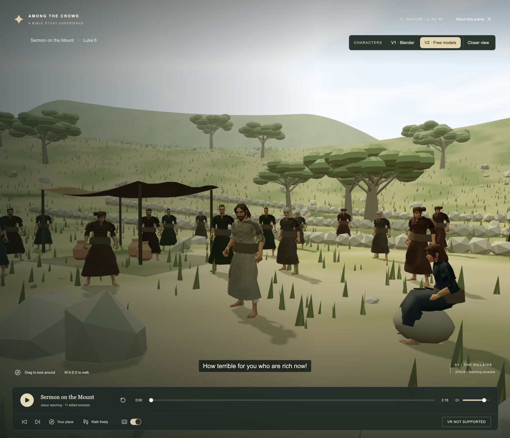
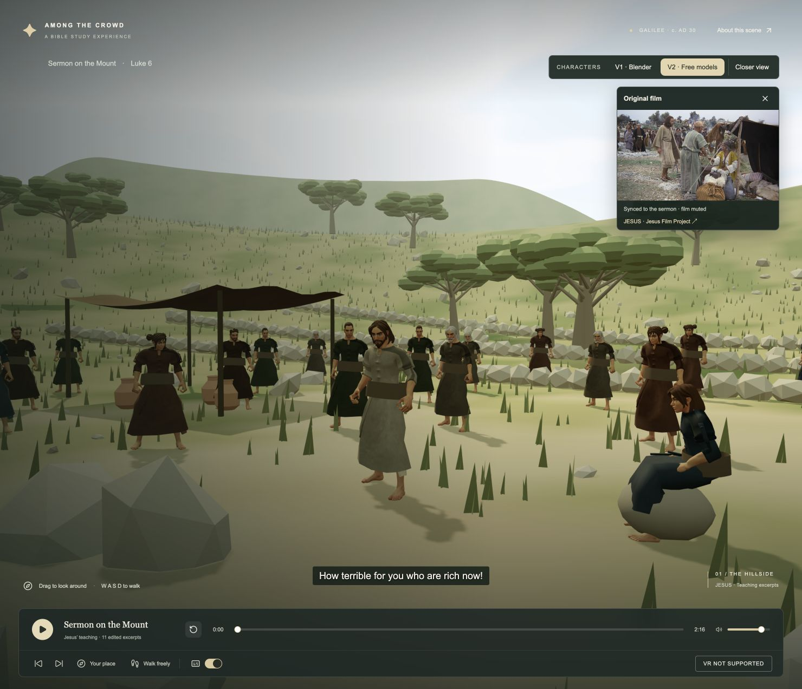

# Original-film comparison

## Change

The scene now shows a floating original-film panel after entering the sermon.
It sits below the character selector, follows the existing transport, and works
with either character version. Hide it to recover the original unobstructed view;
Show original film restores it at the current sermon position.

The source film is muted so the existing positional sermon audio remains the only
audio. The eleven edit ranges map back to source-film time; inserted silent pauses
hold the previous source frame. Seeking, restart and excerpt changes resynchronize
the film. Closing the panel releases its player and network stream.

The panel uses the existing official HLS source, loaded on demand with HLS.js or
native HLS when Media Source support is unavailable. A loading/buffering status,
retry action and official source link cover unavailable playback.

## Before / after

Matched default camera, V2 characters, paused at 0:00. Crowd idle motion may differ.

### Before

### After

## Review

1. Enter the sermon. Check whether the film helps interpret the teacher's movement.
2. Pause and use Next teaching excerpt: the fourth excerpt begins at edited 0:35.36
   and original-film 1:00.9.
3. Switch V1/V2 and use Closer view to compare the two model performances.
4. Hide and restore the film; check the balance between comparison and immersion.

## Verification

- TypeScript check, all 29 tests, and static production build pass.
- New timeline test covers all eleven cut starts, silent gaps and completion.
- Chrome: source film visibly plays; pause, restart, excerpt seek, model switching,
  hide and reopen verified. Restart holds source 0:04.9; fourth excerpt holds 1:00.9.
- Responsive layout inspected at 390 × 844; film stays above the teacher and transport.
- Failed source loading displayed a retry message while the sermon remained usable.
- Existing build notices remain for copied classic loader assets and large chunks.

## Limits

The stream requires internet. Network buffering can temporarily interrupt the film;
the local sermon continues and the film catches up. Synchronization corrects drift
over 250 ms while playing and 40 ms when paused; this is not frame-locked playback.
The panel is a desktop/mobile HTML overlay and does not appear inside immersive VR.
Physical mobile devices and headsets have not been tested. No public deployment has
been made as part of this review.
