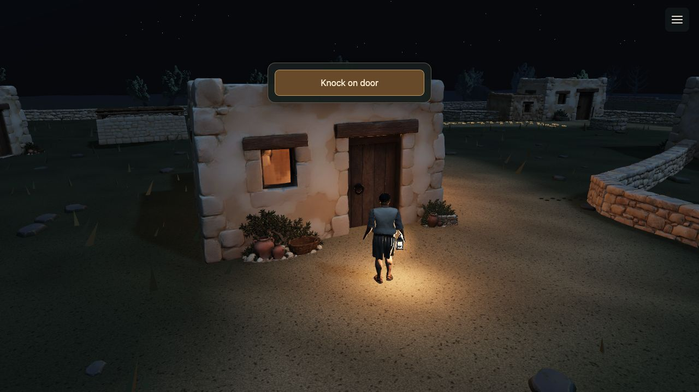
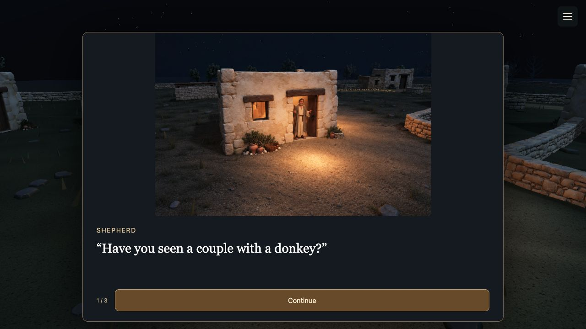

# House encounters — playthrough review and proposed changes

17 September 2026 · Branch: `codex/shepherd-feedback-house-handoffs` · Baseline: `385e199eb0152683d53989b5c0bc4d648a5e3c07`

**Recommendation:** start with House 8 and improve the illustrated doorway handoff and the farewell as one small piece of work. Then apply the accepted treatment to Houses 3 and 9. The current short dialogue and clear actions already work reasonably well; the largest remaining break is the change in scale, viewpoint and presentation around the conversation.

This document retains the pre-change review as its baseline. The implementation follow-up below records the first bounded experiment; it is awaiting the user's playtest and does not claim player-facing acceptance. It follows F05/F06, I03 and T03, with related I02 presentation and I01 sound work. [Current roadmap](../../README.md).

## What was played and what this evidence establishes

I used the normal local player and clicked through the route from the lamp preparation to departure from House 9 toward the Nativity. All five house encounters were played from arrival through their next action: Houses 1, 3, 5, 8 and 9. House 5 includes the well search and departure toward the pen; House 9 includes the reunion and following the companions. The opening scripture was skipped. An initial House 8 rehearsal inspection was used only to orient the review; the saved screenshots below are from the normal player.

- Browser: Codex in-app browser; browser version and physical-device performance class were not established.
- The existing local server on port 8766 was used; its process working directory was verified as this prototype's directory.
- View: 1280 × 720, plus a 390 × 844 portrait spot-check of House 8's final dialogue page. Portrait was a viewport resize, not a physical phone test. The original viewport was restored.
- Input: pointer clicks, plus Escape/menu Continue at House 9. Reduced motion was off. That pause/resume retained page 4/4 and its text.
- The game ran at its ordinary simulation speed. Reading pages were held while inspected. Screenshots capture successive states, not continuous video; they establish composition and action order, not frame smoothness or precise perceived pacing. Screenshot times are in [captures.json](captures.json).
- No controlled cold-cache, network-failure or performance test was performed. No image-error fallback appeared during this route. The browser's retrieved warning/error log was empty: [browser-log.json](browser-log.json).
- **Live sound was not available to the review tools.** The starting screen showed Sound on. Audio observations below come from source inspection, not listening. Perceived volume, timbre, warmth, intelligibility and the reported missing House 1 voice remain unassessed.
- The pre-existing dirty file was `projects/portal/publication-inventory.json`; this review did not edit it. Screenshots are original browser JPEGs, with no image edits. They are baseline evidence, not before/after comparisons.

## Findings against the feedback

| Concern | Verdict and confidence | Evidence and consequence |
| --- | --- | --- |
| **F06: smaller house and disappearing shepherd** | **Verified visually; high confidence.** Present in Houses 3, 8 and 9. | The illustration is a small view of the entire frontage inside a large card. The surrounding 3D scene remains visible. On desktop the card covers the shepherd; in portrait his lower legs remain below it. There is no visible viewpoint change that explains this. The conversation feels detached from the doorway just approached. |
| **F05: door closes before thanks** | **The literal old ordering was not reproduced in current House 8; high confidence in current order.** | All three House 8 pages hold the open-door image. “Thank you” appears on the final advice page. Clicking it dismisses the image and exposes the closed 3D door immediately. The earlier copy pass improved the order, but the farewell is still an abrupt state change. |
| **F05/F10: image and text meaning** | **Current lines are coherent; transition remains weak.** High confidence in the observed sequence, moderate confidence in the experience judgment. | House 3's pointing image accompanies gate directions; House 9's pointing image accompanies pen directions. House 8 uses one image throughout, so there is no mid-reading door closure. The weak moments are entering/leaving the illustrations, especially House 9's immediate change to the reunion camera. |
| **F03/F04: simplicity and attention** | **Copy has improved; presentation still competes with the scene.** Agent judgment, moderate confidence. | Lines are brief, speakers are labeled, and next actions are understandable. Large caption space and a wide button dominate a much smaller resident. House 8's four-word “I haven’t seen them” occupies a separate page, followed by a second onward confirmation after the conversation. |
| **F02/F07/F12: atmosphere, missing voice and mix** | **Source audit only; listening verdict unavailable.** | The active house code supplies knocks and House 1's refusal voice. Illustrated dialogue has no voice or door-opening/closing cue. The normal village path has no continuous night bed or general player footsteps; the reunion has its own limited footstep effect. These are implementation findings, not proof of what reached the speakers. |

House 8 in the current normal player:

| At the door | During the conversation |
| --- | --- |
|  |  |

The [portrait capture](h08-06-advice-portrait.jpg) makes the split composition especially clear: the little illustrated resident is above the large shepherd's exposed lower legs. The text and Thank you button are readable without scrolling at this size; the problem is visual continuity, not text overflow.

The layout helps explain the result. The measured desktop card is 920 × 634. Its art element is 918 × 402, but `contain` fits a 1536 × 1024 image into only **603 × 402** of that area. That image includes a whole house, sky and ground. This leaves the person very small. [DOM measurements](illustration-layout.json) · [shared CSS](../../../../house-sighting.css) · [conversation presenter](../../../../src/house-sighting-scene.mjs).

## Per-house review: arrival, encounter, departure

| House | What worked | What I would improve | Baseline evidence |
| --- | --- | --- | --- |
| **1 — refusal** | One obvious Knock action. Short refusal remains readable until an explicit “Let’s try the next house.” The shepherd and house share the same continuous 3D view. | Retain this structure. Diagnose voice readiness under I01; a successful subtitle is not an audio result. Judge the existing knock/response rhythm with sound before changing its duration. | [Arrival](h01-01-arrival.jpg), [refusal](h01-03-refusal.jpg), [next action](h01-04-departure-ready.jpg), [leaving](h01-05-leaving.jpg) |
| **3 — sighting** | Three concise pages: question, sighting, gate directions. Speaker labels and pointing make the lead understandable. Thank you precedes the onward action. | Replace the miniature illustration handoff and give thanks a small visible consequence before returning to the closed doorway. Keep “Go to the gate.” | [Arrival](h03-01-arrival.jpg), [question](h03-03-question.jpg), [directions](h03-05-directions.jpg), [return](h03-06-return.jpg), [leaving](h03-07-leaving.jpg) |
| **5 — unanswered door and tracks** | The dark house stays in the same scene. “No answer” and “Search by the well” are economical. The revealed tracks and next button clearly support the next move. | Preserve its distinct unanswered visit. Let a quiet environmental bed continue while nobody answers; a silent resident need not imply an empty soundscape. Reassess the two knock rounds audibly before shortening them. | [Arrival](h05-01-arrival.jpg), [no answer](h05-03-no-answer.jpg), [leaving door](h05-04-leaving-door.jpg), [tracks](h05-05-tracks.jpg), [leaving for pen](h05-06-leaving-for-pen.jpg) |
| **8 — advice** | The door stays open through the question, response and advice. The next destination is explicit, and the wide view shows the stall's relationship to the village. | First exemplar for matched framing and a proper farewell. Combine the old man's brief reply and advice into one page. Integrate the stall reveal into the return, leaving one departure button. | [Question](h08-03-question.jpg), [response](h08-04-response.jpg), [advice](h08-05-advice.jpg), [return](h08-07-return.jpg), [stall reveal](h08-09-stall-reveal.jpg), [leaving](h08-10-leaving.jpg) |
| **9 — shelter and reunion** | The owner explains the shelter and points onward. The reunion makes the gate lantern useful, and “Follow the others” clearly starts departure. Pause/resume preserved the final owner line. | Finish the owner's farewell before redirecting attention to the gate. Use approaching companion sound and a motivated camera turn to lead into the existing reunion. Keep the current short owner and companion exchanges initially. | [Question](h09-03-question.jpg), [directions](h09-06-directions.jpg), [immediate gate view](h09-07-return-to-reunion.jpg), [reunion](h09-08-reunion-question.jpg), [following](h09-12-leaving.jpg) |

## The two changes I would make first

### 1. Keep the conversation in the same visual space

Replace the framed overview of a house with a conversation view focused on the doorway. Match the illustrated door's screen position, size and perspective to the final 3D approach. Use the illustration as the scene backdrop with compact dialogue laid over it, so a second, differently sized house is not visible around a card. Preserve the warm interior, cool night and lantern light that already give the encounters their atmosphere.

My preferred first experiment is **retaining the shepherd in the foreground** at the same scale and position, with the matched illustration behind him. This follows the current third-person view and retains the visible source of the lantern glow. The composite must match lighting, edges and occlusion; a pasted figure with drifting feet would introduce another break.

Compare that against the already requested **deliberate first-person transition**: visibly move toward the shepherd's viewpoint, hand off to matching doorway art, and return along a coherent camera path. That may give the resident more presence, but the current elevated illustrations may not support an eye-level view through cropping alone. This review does not select either experiment on the user's behalf.

Test framing with existing images first. Use the door lintel, threshold and window as alignment references. Keep the crop stable while the resident changes pose. If a particular image cannot match the selected view, document that mismatch before proposing replacement art.

Place the brief line and speaker close enough to the encounter that the eye travels a short distance, using a predictable shared layout with safe space for the resident's face, hands and the shepherd. Reduce empty caption space. Keep the existing clear action labels for this trial; arrows are not needed to solve the verified problem. Review desktop and portrait together.

### 2. Give the encounter a clear farewell and one onward choice

For House 8, I propose this sequence:

| Beat | Visible experience | Player action |
| --- | --- | --- |
| Arrival | Shepherd faces the lit doorway in 3D. | **Knock on door** |
| Response begins | Knock and a short anticipation beat; move into the chosen matched view as the resident answers. | Automatic scene action, with a visible response to the knock. |
| Question | Open doorway, resident present. Shepherd: “Have you seen a couple with a donkey?” | **Continue** |
| Advice | Same stable doorway. Old man: “I haven’t seen them. Try the empty stall by the gate. They may be resting there.” | **Thank you** |
| Farewell | A brief acknowledgment while the resident is still present, then a coherent closure and return to the village. | Follows the Thank you action; no extra confirmation page. |
| Orientation | The return leads into the existing stall reveal, with the shepherd remaining at the door. | **Go to the stall** |
| Departure | Shepherd takes the established route around House 7. | Starts only after that explicit action. |

This keeps the current wording but combines the old man's two short lines. It removes one Continue and the separate “Find the empty stall” confirmation: six clicks from Knock through departure become four. This is a proposed revision to accepted presentation, not a claim that the previous pass authorized it.

The farewell needs a visible cause and consequence. A short nod/settling pose and coordinated door closure would communicate thanks better than the card vanishing. The precise treatment depends on the selected handoff experiment and available art. An undirected dissolve between mismatched views would not solve the scale or story problem. Keep reading player-paced, and put only the physical response in the short automatic transition; its duration should be judged in motion.

For House 3, reuse the accepted handoff and farewell before “Go to the gate.” For House 9, settle the farewell, establish approaching companions, then turn toward the gate and run the existing reunion. Houses 1 and 5 retain their closed-door encounters.

## Sound that would support these changes

The source audit found three relevant limitations:

1. [Shared house sound](../../../../src/house-scene.mjs) synthesizes knocks and fetches House 1's voice. It starts decoding asynchronously when Knock is pressed, while the voice cue at 3.3 active seconds is marked played even if the buffer is not ready. This remains a plausible cause of F07, not a reproduced audible failure.
2. [Illustrated conversations](../../../../src/house-sighting-scene.mjs) contain images and text only. There is no resident voice, hinge/latch cue or farewell sound in that presenter. House 1's voice is therefore an exception across these visits.
3. [The active village entry](../../../../src/village-game.mjs) has no general player-footstep or continuous night-ambience owner. [Reunion footsteps](../../../../src/companion-reunion-scene.mjs) are a limited existing effect and should be retained. Ambient code in the older `journey.mjs` is not evidence that the current village path plays it.

I would support the visual work with a restrained continuous night bed, movement-linked approach/departure footsteps, and small synchronized door/latch sounds where a door visibly moves. Keep that bed alive through the illustrated handoff and farewell. At House 5, maintain the environmental bed while the house gives no reply. At House 9, let companion footsteps direct attention before the camera changes focus.

House 1 needs reliable cue readiness or a useful silent fallback. Route these sounds through the shared sound preference and mix work in I01, and audition them against its existing voice. I would not add automatic narration of every line in this pass; the later voice/localization initiative can use the settled dialogue. No specific sample, gain or perceived sound quality has been approved by this review. Validate on ordinary speakers, including muted play, pause/resume and delayed audio readiness.

## Proposed implementation boundary and acceptance

Build and review the two House 8 framing alternatives first, using the same approach, dialogue and return. Select the stronger visual treatment, then add the farewell and simpler onward sequence. Review that complete encounter before applying the treatment to Houses 3 and 9. Supporting sound should use I01's shared ownership rather than another isolated scene audio context.

| Criterion | Current review | What the revised encounter must demonstrate |
| --- | --- | --- |
| Same place and viewpoint | Needs revision; high confidence, F06 screenshots above | One doorway at a consistent scale; no unexplained avatar disappearance, partial legs or competing duplicate backdrop. |
| Clear image/text relationship | Current words coherent; farewell needs revision | Resident remains available through thanks; visible closure follows the action; next lead is clear without explanatory recap. |
| Simplicity | Clear labels; two removable House 8 steps identified | Two readable dialogue pages and one explicit departure action after the reveal. No accidental travel from a conversation click. |
| Atmosphere | Warm/cool visual contrast worth keeping; audible quality unassessed | Lantern/interior lighting stays consistent; heard ambience and effects bridge the transition without obscuring dialogue. |
| Responsive presentation | Portrait text fits; composition fails | Resident, shepherd/viewpoint and essential gestures remain legible in desktop and portrait layouts. |
| Timing and resilience | Sequence observed; continuous motion, failures and mix unassessed | Normal-speed review of arrival through departure; rapid clicks, pause, reduced motion, slow/failed imagery and audio retain a coherent state. |

Use matched baseline/revised captures for framing and a normal-speed recording plus actual listening for the final judgment. Check the modest-device cost of any compositing or extra media. The work touches the shared conversation presenter/CSS, house completion states and the two outgoing camera handoffs; it does not require a general rewrite of the route.

The next design review should answer one question: **which House 8 handoff keeps the doorway and shepherd's viewpoint most believable while making the old man easy to attend to?** The proposed farewell and four-click sequence can then be judged in that view.

## Implementation follow-up — 18 September 2026

The first low-risk experiment is now implemented on this branch:

- The shared illustrated house presenter (Houses 3, 8 and 9) fills the art area with a doorway-forward `cover` crop and a small scale-up. The image remains the existing authored plate; no replacement assets were generated. This deliberately tests the crop/scale treatment before attempting a composited shepherd or a first-person camera handoff.
- House 8 now has two reading pages: the question, then the old man's reply and stall advice together. Selecting **Thank you** disables the control, fades the illustrated card, and starts the existing stall orientation automatically. The player sees **Looking toward the stall…**, then gets one explicit **Go to the stall** action. There is no separate “Find the empty stall” confirmation.
- Houses 3 and 9 keep their current page counts and route states while receiving the same doorway crop and the brief fade when their conversations finish.

Technical checks passed: `node --check` for the changed modules, House 8/3/9 state checks, the full route rehearsal and camera samples, and `git diff --check`. A browser spot-check on the local rehearsal verified the larger doorway composition, the combined House 8 line, the automatic stall reveal, the explicit stall departure, and the shared House 3/9 framing; browser warning/error logs were empty. Live sound, physical-device behavior, reduced-motion portrait composition and continuous-motion comfort still need human review. The crop/scale experiment also leaves the avatar behind the opaque illustrated card, so F06 is not declared solved until the playtest judges this treatment.
