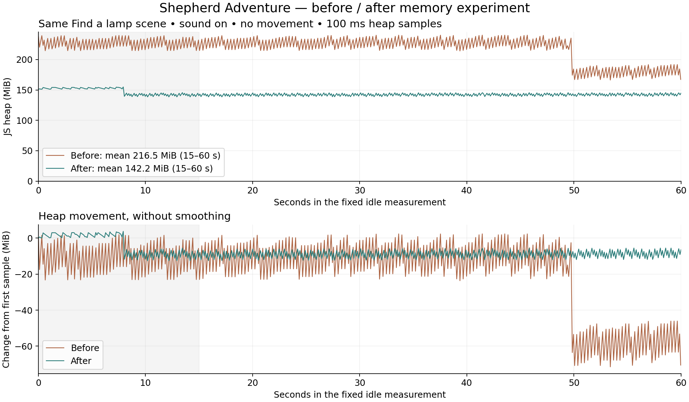
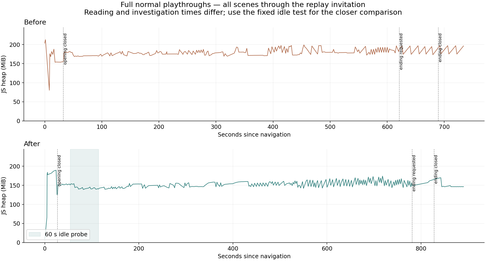

# Shepherd Adventure — memory optimization proof of concept

18 September 2026 · Local branch `codex/shepherd-memory-optimization` · base
`a9518851ecabd6d41f9030923f46a27266956608`, plus the D041 local profiler.
The original profiling checkout and unrelated portal changes were left untouched.

## What changed

- One sheep load and shared geometry/materials/textures, with five independent
  skeletons and staggered animations. Model loads fall from 40 to 36.
- Family textures: 4096 → 2048 px, preserving their geometry and animation.
  Selected static scenery: 1024 px textures, except the shelter at 2048 px, plus
  bounded mesh simplification. The selected GLBs fall from 120.2 to 82.8 MiB;
  their unique triangle count falls from 1.986 million to 1.405 million.
- Camera candidates, vectors, obstruction inputs, audio environment and UI
  comparison state are reused instead of rebuilt every frame. The camera ray/box
  hot loop uses direct coordinate fields; an isolated allocation profile identified
  the dynamic-axis calculation as the bigger remaining source after the first pass.
- The world stops rendering/updating behind the opening/ending and while paused
  or hidden; a paused resize can draw one replacement frame. Inactive scene audio
  contexts are suspended. World assets remain retained for immediate replay.

[Asset settings, measured changes and hashes](../../../../assets/optimized/provenance.json) ·
[Rebuild script](../../../../checks/build-memory-assets.mjs) ·
[Verification](verification.md). Originals remain available; this does not replace
the loading architecture or fix the music transition. No forced GC was introduced.

## Measurement method

Both builds ran in the same desktop Chromium 152 IAB, 1280 × 720, DPR 1, sound on,
normal motion. This environment reports 12 hardware threads and 32 GiB device
memory; those values are browser metadata, not physical-device certification.
The optimized full run used normal computer-controlled actions for all opening
verses, lamp assembly, ten route points, house conversations, reunion, arrival,
all ending verses and the replay invitation. No skips or scene jumps.

Full routes use two-second samples; reading/investigation pauses differ, so their
averages are descriptive rather than a perfectly matched benchmark. In addition,
both builds receive a fixed 60-second idle probe at **Find a lamp**, after the
ten-second entry run, with approximately 100 ms heap samples and frame intervals.
The baseline and first-pass short probes used **Skip story** to reach that scene.
The final probe follows every opening verse, and is included in the final full run.
In all cases the same entry animation finishes before the idle measurement.
Probe start times are recorded; the final test starts about 14 seconds later than
the baseline. We show all 60 seconds and summarize the predefined 15–60 second settled window.
No user interaction, CPU-heavy verification or forced collection during that window.
The final full-route gameplay mean excludes the added idle probe when compared
with the baseline; raw means are also retained in the JSON.

Cache and browser GC state are not reset identically. This is one paired desktop
experiment, not a randomized device benchmark or a total-process RAM measurement.
The profiler itself adds overhead to both builds.

## Paired results

| Measurement | Before | After | Reduction |
|---|---:|---:|---:|
| Full-route gameplay heap mean | 178.9 MiB | 152.8 MiB | 14.6% |
| Fixed idle heap mean (15–60 s) | 216.5 MiB | 142.2 MiB | 34.3% |
| Fixed idle middle-90% heap span | 65.4 MiB | 6.0 MiB | 90.8% |
| Geometry backing stores | 127.8 MiB | 100.3 MiB | 21.5% |
| Texture RGBA+mipmap estimate | 1996.2 MiB | 1100.2 MiB | 44.9% |

The fixed idle probe's observed positive heap movement fell from **56.0 to 15.8
MiB/s (72%)**. This is a sampled proxy, not all allocated bytes. The p95 frame
interval was **17.6 ms before / 17.9 ms after**, with medians of 16.7 ms: no frame-rate
improvement is established. Downward steps over 1 MiB were 150 / 183; the result is
smaller swings and less upward movement, **not fewer proven GC events**.

The baseline idle trace includes a large late collection; the final trace collects
earlier. Thus the 34% fixed-window mean reduction is not a general whole-game RAM
saving. The full-route mean reduction is a more modest **14.6%**, and reading pace
and browser collection timing still differ. The later route retains visible
sawtooth behaviour; the fixed-scene improvement does not prove every scene is smooth.

Final normal run: **890.3 seconds**, 457 samples, all ten points and both dioramas,
plus the 60-second idle probe. Baseline: 733.7 seconds, 376 samples. The final export
has no dropped records or recorded errors; all seven ambience recordings loaded,
with five sheep calls, one jackal, one wolf and three frog events. After completion,
story leases are empty and gameplay/House 1 audio contexts are suspended. The replay
invitation was observed for 62 seconds, then replay returned to the opening.

Startup world first-render marker: 10.37 → 5.85 seconds; largest observed long task:
about 6.6 → 3.26 seconds. These are individual local runs with differing cache/GC
state, not a controlled loading-speed benchmark. The remaining multi-second block
still needs attention. Unique touched asset files fell from about 193.2 to 155.8 MiB.

[Machine-readable comparison](comparison.json) · [Final summary](after-summary.json) ·
[Final full route](after-full-route.json) · [Before idle](before-idle.json) ·
[After idle](after-idle.json) · [Original full route](../2026-09-18-memory/full-route.json).

## Interpretation and next focus

A sawtooth trace is consistent with allocation followed by garbage collection.
Removing avoidable allocations is useful, but a perfectly flat line is not a
goal by itself: retaining unused objects can flatten a graph while wasting memory.
Observed downward steps are not actual GC event counts, and sampled upward changes
are not a complete allocation-rate measurement. Frame intervals alone cannot
identify GC pauses. [MDN documents the limitations of the legacy heap counter](https://developer.mozilla.org/en-US/docs/Web/API/Performance/memory).

The retained graphics inventory is the stronger evidence of deterministic savings.
Geometry backing stores, decoded images, texture estimates and JS heap overlap;
**do not add them**. The texture estimate is logical RGBA+mip storage, not measured
GPU residency. Audio remains roughly 14 MiB; no audio quality reduction was needed.

Keep this as a reviewable first step. Review visual quality at the nativity and
near decorated houses, then measure on an ordinary laptop and one representative
weaker phone. There is no universal safe 200 MiB heap budget: it excludes substantial
other browser/graphics allocations and devices impose different limits.

Next, profile the remaining late-route allocation bursts, reduce the remaining
texture footprint and investigate the startup main-thread
block. Then compare bounded background preparation with all-upfront loading while
keeping music ownership independent of scene transitions. This experiment provides
no reason to preserve disruptive intermediate loaders as a memory-saving mechanism:
the world is still retained throughout. It also does not prove that loading every
asset at startup is safe on weaker devices.

For cleanup, keep shared resources owned at world scope and reuse them while needed.
When a future flow truly leaves the adventure, dispose GPU resources and release
scene/audio references through that owner. Repeated full cycles and allocation/
retainer traces are still needed to establish leaks and actual GC pause costs.

## Scope and review status

The user accepted this bounded memory initiative on 18 September 2026 and authorized
commit, PR review, merge after passing CI, and local branch/worktree cleanup (D043).
The paired heap charts above are the before/after memory captures; raw files and
reproducible analysis accompany them. This acceptance does not establish physical-device
performance or a separate visual/listening playtest. Loading/music redesign remains open.
The publication manifest includes the optimized runtime assets and opt-in profiler.
