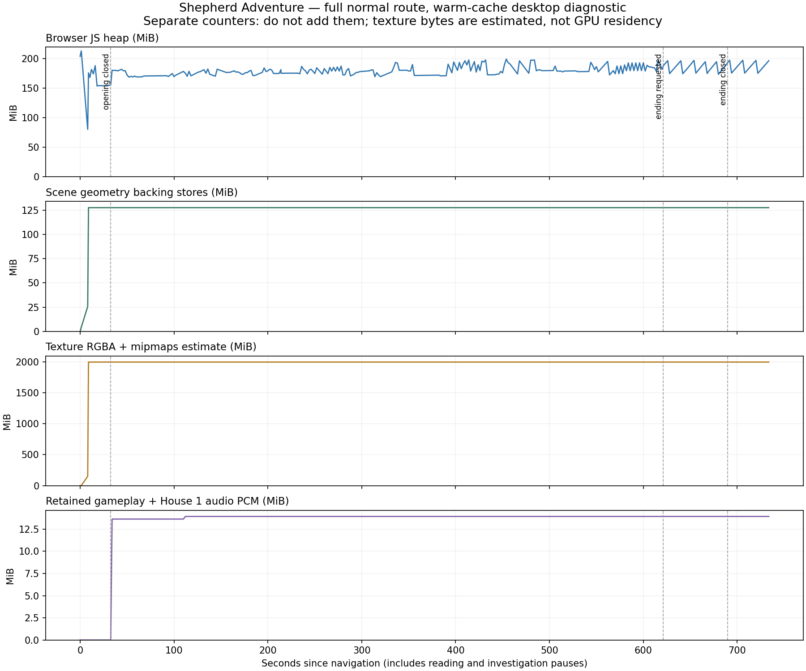

# Shepherd Adventure: memory and loading investigation

18 September 2026 · I04 / I08 · D041 · local branch `codex/shepherd-memory-profile`

**Recommendation: reduce retained world resources first, then test one initial
preparation period plus selective background preparation and continuous transitions.**
The existing intermediate loaders do not unload the village. Removing them will
not, by itself, make the current graphics allocation larger or smaller. A blanket
“load every asset before Start” change is not supported by this desktop baseline.

## Scope and evidence

Base revision: `a9518851ecabd6d41f9030923f46a27266956608`, plus this branch's
opt-in instrumentation. The unrelated existing portal inventory edit was left
untouched. No asset, loading-policy, dialogue or sound-mix changes were made.

Played the normal entry with computer-use controls: all opening verses → running
intro → lamp assembly → Houses 1 and 3 → barred gate → House 5 and well inspection →
animal pen → House 8 → empty stall, ignition and rear gate → House 9 → companion
reunion → Nativity approach/arrival → all ending verses → replay invitation.
No scene jumps, time acceleration or skip controls were used for this full run.
The subsequent **replay smoke check** skipped the opening story after starting it;
it is not a second complete playthrough.

- [Full-route export](full-route.json): 376 samples over 733.7 seconds, including
  about 44 seconds on the replay screen. Durations include investigation pauses,
  not representative player reading time.
- [Summary](summary.json), [observed asset audit](assets.json), [timeline](timeline.png).
- [Replay checkpoint](replay-checkpoint.json): cumulative export through replay's
  return to gameplay; world model-load count stays at 40.
- [Fresh-origin startup](fresh-origin-startup.json): separate tab on `localhost`
  after closing the full-run tab on `127.0.0.1`. This changes the HTTP cache origin;
  it does not certify a fresh browser process or cleared OS/GPU cache.
- [Reusable profiler instructions](../../../memory-profiling.md).

Browser: Codex in-app Chromium 152 on macOS, 1280×720, DPR 1, normal motion,
sound enabled. Browser reported 12 hardware threads and 32 GiB device memory;
these are browser metadata, not a physical-device certification. Localhost network,
no CPU/network throttle. The full run used a warm/mixed cache after an instrumentation
pilot: 19.0 MiB transferred against 210.5 MiB of response bodies, including repeated
requests. Fresh-origin startup transferred 173.5 MiB against 187.6 MiB of response
bodies. This is not a slow-network or low-end-phone result.

The pilot was discarded after finding that the new profiler's buttons could trigger
the game's generic decision-audio handler. The full run excludes those clicks from
that handler. The final profiler also excludes its pointer/key interactions from
audio unlock and exposes HTML audio playback state; these two diagnostic refinements
were tested in the fresh-origin run and do not change the memory inventory method.

## Results

Counters have different scopes and **must not be added together**. MiB = 1,048,576
bytes. Graphics figures are logical resource estimates, not measured GPU residency.

| Moment | Browser JS heap | Geometry backing stores | Texture RGBA + mipmap estimate | Retained audio PCM |
| --- | ---: | ---: | ---: | ---: |
| Fresh-origin initial HTML | 9.5 MiB | 0 | 0 | 0 |
| Fresh-origin opening visible, before world creation | 10.8 MiB | 0 | 0 | 0 |
| Fresh-origin world first render | 196.4 MiB | 127.8 MiB | 1,996.2 MiB | 0 |
| Full-run opening just before departure | 155.3 MiB | 127.8 MiB | 1,996.2 MiB | 0 |
| Running intro, audio prepared | 179–181 MiB | 127.8 MiB | 1,996.2 MiB | 13.6 MiB |
| Village route | 169–199 MiB | 127.8 MiB | 1,996.2 MiB | 13.9 MiB after House 1 |
| Ending diorama | 173–197 MiB | 127.8 MiB | 1,996.2 MiB | 13.9 MiB |
| Replay invitation, 44-second observation | 175–197 MiB | 127.8 MiB | 1,996.2 MiB | 13.9 MiB |

Full-run sampled heap peak: **212.8 MiB**, during startup. The warm reload starts
with 203.7 MiB from an already-used browser heap and falls as collection occurs;
do not interpret that initial value as a clean app baseline. Fresh-origin startup
begins at 9.5 MiB and peaks at 206.5 MiB in its samples. Neither sample interval nor
this browser counter guarantees the true transient peak.

All seven gameplay recordings loaded and decoded without recorded failures.
The run triggered five sheep bleats, one jackal, one wolf and two frog events;
all three household beds were visited. House 1 retained a decoded 0.29 MiB voice
buffer. Gameplay recordings account for 13.16 MiB, procedural sounds for 0.46 MiB.
HTML music decoder memory and short-lived synthetic sound buffers are not measured.
Browser errors/warnings were empty; this verifies loading/state, not subjective
listening quality.

The scene contains 799 mesh objects, 622 unique geometries and 645 materials.
Geometry backing-store bytes stay flat after initialization. Uploaded geometry
counts rise from 165 to 535 as different views first render; logical scene geometry
count remains 622. Uploaded texture count settles at 103; shader programs grow
from 30 to 98 (100 after replay). First-use GPU work remains a profiling lead.

## What the transitions actually do

1. The opening becomes visible at **0.09 seconds** on both measured entries.
   `boot.mjs` then imports/builds the entire world, including the Nativity, while
   that opening remains on screen. World assets are ready near **8.9 seconds**,
   with first render around **10.35 seconds**, in both startup samples.
2. Preparation is not smooth background work: the fresh-origin sample contains
   a **6.56-second main-thread long task**, plus roughly 1.10 and 1.48 seconds.
   Warm startup has a 6.75-second task. These are measured blocking intervals,
   not proof of the reported in-route camera-freeze cause. Parsing, world creation,
   shader preparation and rendering need a trace to attribute the cost precisely.
3. At Start adventure, the opening player is destroyed and its **5.35 MiB Blob
   lease / seven object URLs** are released. Music is paused as part of that
   destruction. The 3D world is already prepared; there was no story→world loader
   needed in this full run. Gameplay recordings start fetching at this boundary.
4. House illustrations prepare on interaction. They are much smaller additions
   than the already-resident world, but can still create perceptible cold-network
   waits. Their decoded browser-cache lifetime is not controlled by destroying
   the DOM player alone.
5. The ending manifest/media are first requested at arrival; **no ending prefetch
   call exists in the current normal flow**, despite older README claims.
   The local measured request-to-visible interval was **60 ms**. Its five-URL
   Blob lease reaches **5.64 MiB**, including reused music. The world is retained
   underneath, not unloaded to make space.
6. Finishing the ending releases that lease, leaving zero story leases/object
   URLs. The world and gameplay PCM remain for replay. Gameplay AudioContext is
   suspended; House 1's separate context is still running, though it has no active
   tracked sources. The world render loop still draws behind story/end overlays
   (`renderer.render` is unconditional), wasting work even when simulation is stopped.
7. Replay reuses all 40 completed model loads and the audio buffers. No additional
   model load or geometry/texture inventory growth was seen at re-entry. This is
   useful reuse evidence, not a multi-cycle leak proof.

## Where to focus assets

The full route touches **193.2 MiB of unique local asset files**, excluding JS/CSS.
Compressed file size is not the same as decoded texture cost. The scene inventory
contains roughly **1,497 MiB of RGBA image sources** and **1,996 MiB with mipmaps**.
Those two figures overlap and are not independent memory totals. Native decoder,
GPU driver, shadow/render-target, browser cache and process allocations remain unknown.

| Target | Current evidence | First experiment |
| --- | --- | --- |
| Mary, Joseph and baby/manger | Two 4096² images each; 512 MiB combined texture estimate | Test 2048² close-up textures: theoretical saving **384 MiB** before GPU compression |
| Five sheep | Same GLB loaded/parsed five times; 320 MiB combined texture estimate | Load once; skeleton-safe clones with separate animation state and shared geometry/textures: theoretical saving **256 MiB** |
| Four house decoration assets | About 43.6 MiB of files; source meshes approximately 149k–216k triangles, repeated around houses | Reduce mesh detail and test 1024² scenery textures at actual camera distance |
| Nativity stall and trough | About 19.6 and 9.8 MiB files; approximately 394k and 149k triangles | Geometry LOD/simplification with silhouette/contact checks |
| Other scenery textures | Predominantly 2048²; substantial cumulative decoded cost | Test 1024² and GPU-compressed textures, measuring visual impact and decode time |

The first two experiments alone predict **640 MiB less logical texture storage**,
about 32% of the present estimate, without changing the scenes or audio. These are
arithmetic projections, not implemented or measured savings. The remaining allocation
would still be large; this is the start of a budget, not a phone-readiness claim.

## Recommended sequence

1. **Asset/resource pass:** fix repeated sheep parses, trial the Nativity texture
   reduction, then simplify the highest-cost scenery. Preserve library originals;
   create independently owned runtime derivatives. Validate close-up appearance.
2. **Ownership and idle work:** stop unnecessary world rendering behind opaque
   dioramas/end UI. Define explicit owners for the shared world, transition audio
   and bounded scene media. Suspend all scene audio consistently. Dispose geometry,
   materials, textures and skeleton resources only when their final owner releases
   them; dropping a scene object alone is insufficient. Keep intentional replay
   caching distinct from a leak. Do not use forced garbage collection as a product
   mechanism. See the [Three.js r169 cleanup guide](https://github.com/mrdoob/three.js/blob/r169/manual/en/cleanup.html).
3. **Transition experiment:** retain immediate lightweight opening presentation,
   prepare the optimized world without long blocking tasks, prepare the next house
   and ending media ahead of arrival, and keep music under an owner that outlives
   each diorama. Keep the last meaningful image/frame until the next scene is ready;
   blend when ready and show contextual status/retry when necessary. This can avoid
   routine intermediate loaders without keeping every future asset decoded forever.
4. **Compare strategies on the target device:** test existing policy versus
   all-upfront versus bounded preparation with the same route/assets, cold/warm
   cache, slow/failed requests and several complete replay cycles. Choose a real
   modest phone as the acceptance floor. Capture browser process/GPU memory and
   allocation retainers alongside this profiler. A smaller viewport or CPU throttle
   does not reproduce a device's memory limit.

An all-upfront strategy may become reasonable after optimization if its startup,
data cost and peak memory fit that device. Current evidence supports the selective
preparation experiment first. Merely keeping the existing loader boundaries offers
no demonstrated world-memory saving.

## Verification and limits

Profiler opt-in/shared-buffer/mipmap/unsupported-counter tests passed; gameplay
audio and ambience tests passed; complete route/camera state checks passed; syntax
and whitespace checks passed. The local export endpoint rejected foreign-origin
and malformed requests. Full player path and replay entry were verified with CUA. Normal startup without
`?profile` also reached the opening with no profiler panel or browser errors.
[Final instrumentation hashes](final-instrumentation-sha256.json) identify the
finished diagnostic code; the earlier full-run refinement distinction is documented above.
Sampling averaged **2.23 ms**, maximum **4.50 ms**, every two seconds; no records
were dropped. Source-model inventory adds one traversal per load. No forced GC.

No isolated total process RAM, actual GPU residency, low-end-device limit or leak-free
multi-cycle guarantee is claimed. The legacy Chromium heap counter may include
shared or recently navigated documents; see [MDN's stated limitations](https://developer.mozilla.org/en-US/docs/Web/API/Performance/memory).
Timing is local and instrumented, with agent interactions and concurrent source
checks; use the long tasks as investigation leads, not a controlled FPS benchmark.
The three loading strategies have not been implemented and compared yet.

I04/I08 remain open for optimization, strategy comparison and human transition
review. This checkpoint supplies the requested baseline and next-step direction.
The diagnostic runtime has not been added to publication allowlists; no commit,
merge or deployment was performed in this session.
