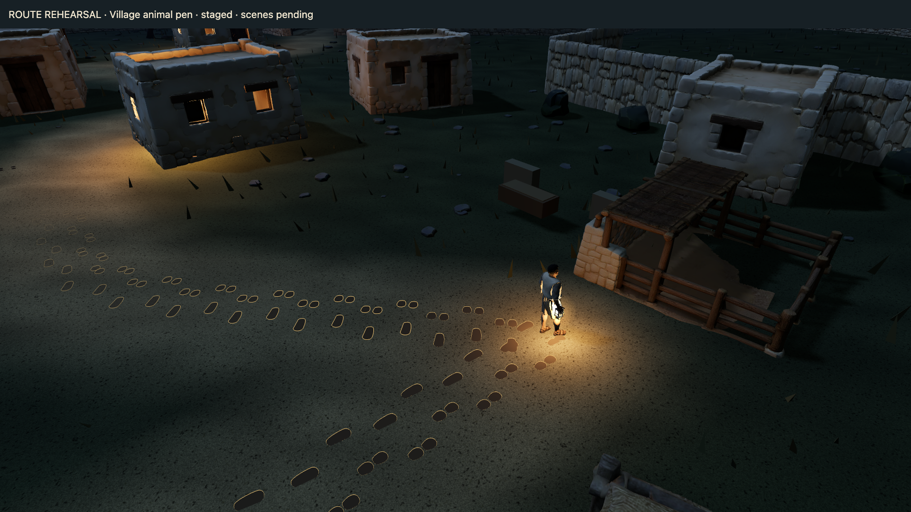

# Animal pen review draft — 14 September 2026

User approved the automatic observation, proposed text and Follow the tracks action before implementation. The user subsequently reported their play-test done and accepted this checkpoint, authorizing audit, commit and push.

The closed pen stays unchanged. Existing sandal and hoof shapes continue outside the entrance along the House 8 corridor. Marks and gold outlines fade with a smooth spatial curve after the first three metres, ending near the residential path at (8, -14), before the door approach. The arrival camera includes the pen and returning trail; portrait uses a wider view. No other scene interactions were implemented.

## Verification

- `node checks/verify-house-tracks.mjs`: passed previous scene phases, duplicate actions, pause, departure, replay and reset.
- `node checks/verify-rehearsal.mjs`: passed route clearance and landscape/portrait route camera samples. These samples do not certify the added observation camera.
- Browser: staged point 06 showed approved text and Follow the tracks; clicking walked to point 07 with its original placeholder and a clear doorway without tracks.
- Portrait 390 × 844 inspected; initial pen cropping prompted wider framing.
- Physical-device performance remains unverified; user play-test acceptance is recorded above.

## User walkthrough

Open http://127.0.0.1:8766/rehearsal.html?point=6&replay for the incoming walk. Check that the marks pass outside the closed entrance, read the thought, then choose Follow the tracks. Watch the turn and gradual fading before House 8. Try Pause/Continue during the walk and Review tools → Replay approach. Check the shot with Reduced motion and on a narrow screen. Later scenes retain their placeholders.

The user authorized a focused feature-branch commit and push after play-testing. No merge or deployment is authorized.
