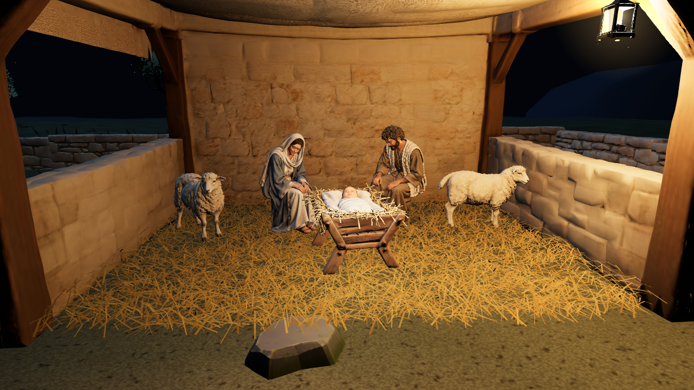
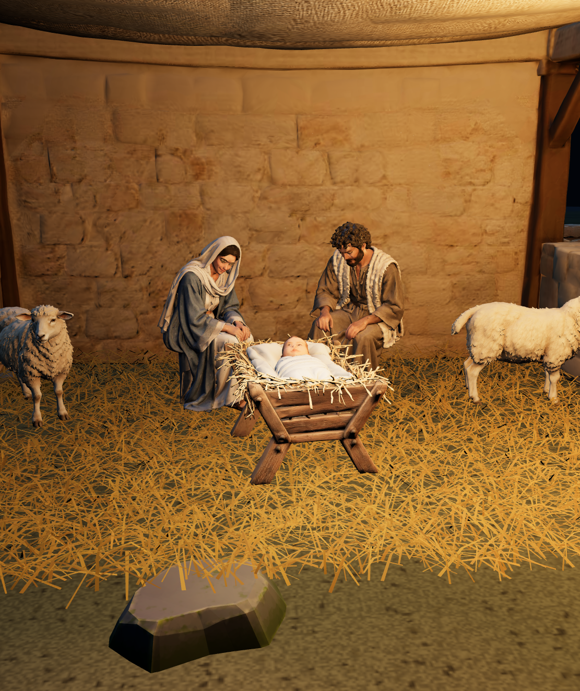

# Nativity staging review — 15 September 2026

## Assessment

The smaller shelter, separate family and idle motion are a useful starting point.
This is **not final close-up character quality or user acceptance**. Mary and Joseph
are seated Pixal3D staging models; their facial, hand and surface detail still need
a final Tripo pass using the settled poses. Automatic rigging of the separate standing
Tripo models did not produce convincing seated robe deformation. Those source models
and rigs are preserved, but the deformed trials are not runtime assets.

## Current composition

- Reused the existing generated empty stall at 3.1 m tall, approximately 5.5 × 4.4 m,
  replacing the 9 × 7 m primitive shelter. A roofless model render established that
  its opening faces source +X; a −90° local yaw aligns it with the eastern approach.
- Added loose straw bedding with thicker wall-side banks, a front-right warm lamp,
  a small reflected-light approximation and slow, restrained lamplit dust motes.
- Mary and Joseph sit independently around a separate static Tripo baby and manger.
  Their eight-second breathing/head idles use a small upper-body rig. Feet, stools
  and lower garments stay fixed; there are no independent hand gestures yet.
- Reused the sheep's real existing head-idle animation, previously sampled once and
  frozen. All five sheep now animate with staggered timing, including the three
  passed on the approach. The two shelter sheep fill the sides without a donkey.
- The debug inspector has standing-eye-level and wide Nativity views plus an idle
  preview switch. Freeze/capture stops ambient motion. Journey progression remains frozen.

[Wide composition](nativity-wide.png) · [Portrait composition](nativity-portrait.png)

## Assets

All runtime files are independent prototype copies, with hashes in `assets/sources.json`.
References and exact native ImageGen prompts, source models, runtime models and render
reviews are retained in the library:

- [Mary](../../../../assets/characters/mary-nativity/README.md)
- [Joseph](../../../../assets/characters/joseph-nativity/README.md)
- [Baby and manger](../../../../assets/characters/jesus-manger/README.md)

The current seated models were generated with Pixal3D at resolution 1024, prepared
with retained 2K atlases and about 120,000 triangles each, then given a local idle rig.
The baby/manger uses Tripo with about 37,700 runtime triangles. Blender sources preserve
the editable seated rigs. No new sheep or donkey was generated.

## Verification

- `verify-nativity-area.mjs`: compact shelter, three separate family assets, five
  sheep, moving head bones for every adult and sheep, reduced-motion/zero-time hold,
  enclosure and route checks passed.
- `verify-nativity-arrival.mjs`: existing arrival, pause/reset and ending checks passed.
- `verify-settlement-stalls.mjs`: model footprints, rotations and regenerated map
  consistency passed. Both settlement and rehearsal maps were regenerated.
- `verify-rehearsal.mjs`: full route checks passed, with 2,002 camera samples each in
  landscape and portrait and zero hidden-player samples. This is automated geometry
  and state validation, not a complete new manual playthrough.
- Browser: inspected the actual debug scene, landscape and 390 × 844 portrait framing,
  idle preview, freeze and saved captures; no browser console errors. Separate Blender model views and animation
  frames were reviewed. Physical-device and performance assessment remain separate.
- Changed publication entries and hashes are updated. The portal build still stops
  at the pre-existing review mismatch for `prototypes/shepherd-adventure/index.html`.
  This pass has not been merged or published.

## Remaining review

Judge the spacing, proportions and quiet motion in `/?debug`, then inspect the normal
arrival/outro transition. The next character pass should generate the agreed seated
poses directly and retain restrained upper-body motion, avoiding large bends of a
standing robe. Close-up texture quality is the main unresolved visual issue. The
reused cloth-roof stall is suitable for this staging test; a timber/reed-roof replacement
would match the outro more closely if requested after review.

Luke 2:16 establishes the family, baby in a feeding trough and visiting shepherds.
The stool, fabrics, straw, shelter design, animal positions and motions are illustrative
choices drawn from the outro, not a verified historical reconstruction. Dialogue and
ending timing are unchanged.

## Family spacing refinement

Moved Mary and Joseph inward by 0.18 m each. Turned Joseph 15° toward the front and Mary another 4.6° toward the baby. Reduced the baby and manger together to 95% scale. Inspected the front debug view: the adults frame the baby more closely, with no visible body overlap. Nativity area checks passed and both settlement maps were regenerated.

Further scale adjustment: reduced the baby and manger by another 10% relative to the previous 95% scale, giving 85.5% of the original size. Adult placement and rotation are unchanged.

Reduced the baby and manger a further 5%, to 81.225% of their original size.

## Superseding character pass

The detailed Tripo family now replaces these staging models. See the [16 September review](../2026-09-16-tripo-nativity/README.md) for current models, captures and validation. Earlier screenshots here document the staging pass.
